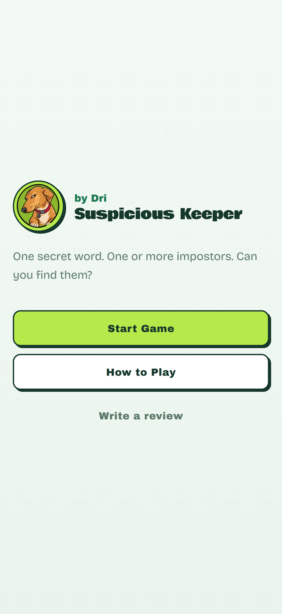

# Suspicious Keeper? by Dri

A mobile-friendly, pass-the-phone social deduction party game. Most players secretly see the same word. One or more players are impostors and do not. After everyone has looked, put the phone down and play the rest of the game yourselves.

<p align="center">
  Play now at <a href="https://drineruu.github.io/suspicious-keeper" target="_blank" rel="noopener noreferrer">drineruu.github.io/suspicious-keeper</a>
</p>

<p align="center">
  
</p>

## Game description

A group shares one phone.

1. Add the players.
2. Choose settings.
3. The app secretly picks a word and assigns impostor(s).
4. Pass the phone around so each player privately reveals their role.
5. The app picks who starts the round.
6. Put the phone down and play.
7. When the group is ready, reveal the impostor(s) and the secret word.

The app does **not** manage clues, discussion, or voting. Those happen around the table.

## Game rules

- **Players:** 4 to 20
- **Impostors:**
  - 4–6 players: 1 impostor
  - 7–11 players: 2 impostors
  - 12–15 players: 3 impostors
  - 16–20 players: 4 impostors
- Normal players see the secret word.
- Impostors do not see the secret word. They may see a related hint, unless that setting is turned off.
- If impostor hints are hidden, a non-impostor starts the round.
- After everyone has a role, the app randomly picks who starts.
- When finished, use **Reveal Impostor(s)** to see the answer.

## Features

- Home screen and How to Play
- Player setup with add, remove, edit, and reorder
- 24-hour localStorage cache for player names only
- Categories, difficulty, and impostor-hint settings
- Random secret word, impostor assignment, and round starter
- Pass-the-phone role reveal with a hidden transition between players
- Game started, reveal confirmation, results, Play Again, New Game, and Quit
- Mobile-first layout and GitHub Pages deployment

## Tech stack

- Vue 3
- Vite
- JavaScript
- Tailwind CSS
- JSON word list
- localStorage for temporary player names

## Local development

```bash
npm install
npm run dev
```

Then open the URL Vite prints, usually `http://localhost:5173`.

## Build

```bash
npm run build
npm run preview
```

`npm run build` writes a static site to `dist/`. `npm run preview` serves that production build locally.

## GitHub Pages deployment

Deploy from your machine with:

```bash
npm run deploy
```

That command:

1. Reads the GitHub repo name from `origin` and sets `VITE_BASE` (for this repo, `/suspicious-keeper/`)
2. Builds the production site into `dist/`
3. Pushes `dist/` to the `gh-pages` branch

The live site is `https://USERNAME.github.io/REPO_NAME/`, currently [https://drineruu.github.io/suspicious-keeper/](https://drineruu.github.io/suspicious-keeper/).

Daily loop:

```bash
npm run dev          # edit and preview locally
npm run deploy       # publish the current build to GitHub Pages
```

`npm run deploy` publishes the build. It does not commit your source on `main`. Commit and push `main` when you want the code saved on GitHub.

One-time Pages setup:

1. Push this repository to GitHub.
2. Run `npm run deploy` once so the `gh-pages` branch exists.
3. Open **Settings → Pages**.
4. Under **Build and deployment**, set **Source** to **Deploy from a branch**.
5. Set **Branch** to `gh-pages` and `/ (root)`, then save.

The base path is configured in one place: [`vite.config.js`](vite.config.js) reads `process.env.VITE_BASE` and defaults to `/` for local development. Override it only if you need a different folder:

```bash
VITE_BASE=/suspicious-keeper/ npm run deploy
```

Do not hardcode GitHub Pages paths in Vue components.

## How to modify words.json

Edit [`src/data/words.json`](src/data/words.json). Words are grouped by category so you do not repeat the category on every line:

```json
{
  "Food": [
    { "word": "Pizza", "hint": "Italian", "difficulty": "easy" }
  ],
  "Bible": {
    "Characters": [
      { "word": "Moses", "hint": "Red Sea", "difficulty": "easy" }
    ],
    "Places": [
      { "word": "Jerusalem", "hint": "Temple", "difficulty": "easy" }
    ],
    "Events": [
      { "word": "The Flood", "hint": "Ark", "difficulty": "easy" }
    ]
  }
}
```

- `word` is the secret word shown to normal players.
- `hint` is the related word shown to impostors, unless **Hide hint from impostors** is on.
- Category names are the object keys. They appear automatically in Game Settings, where you can select any mix of categories.
- A category can be a list of words, or grouped lists (like Bible Characters, Places, and Events). Grouped lists still count as one category.
- `difficulty` must be `easy`, `medium`, or `hard`.

After changing it, restart or refresh the dev server if needed.

## Player caching

Player names are the only data stored in the browser.

```json
{
  "players": ["John", "Mary", "Peter", "David"],
  "expiresAt": 123456789
}
```

- Stored in `localStorage` under `suspicious-keeper-players`
- Expires after 24 hours (`expiresAt`)
- Invalid or expired data is removed and the app starts with empty player slots
- Secret words, impostor assignments, and game phase are never persisted. Refreshing during a game resets the round, not the cached names.

## Project structure

```text
src/
  assets/
  components/
    AppHeader.vue
    PrimaryButton.vue
    PlayerList.vue
    PlayerSetup.vue
    GameSettings.vue
    RoleReveal.vue
    GameStarted.vue
    RevealConfirmation.vue
    GameResults.vue
    HowToPlay.vue
    HomeScreen.vue
    ConfirmDialog.vue
  composables/
    useGame.js
    usePlayerStorage.js
  data/
    words.json
  utils/
    gameUtils.js
    storageUtils.js
  App.vue
  main.js
```

Screens are switched by an in-memory game phase. Vue Router is not used, so GitHub Pages does not need a fallback for client-side routes.

## Future feature ideas

These are intentionally not in this version:

- In-app voting
- In-app clue recording
- Discussion timer
- Vote history
- Impostor final guess
- Online multiplayer
- Accounts, statistics, or a backend

The game state is centralized in `useGame.js` so a later voting phase can be added without changing the static deployment model.
